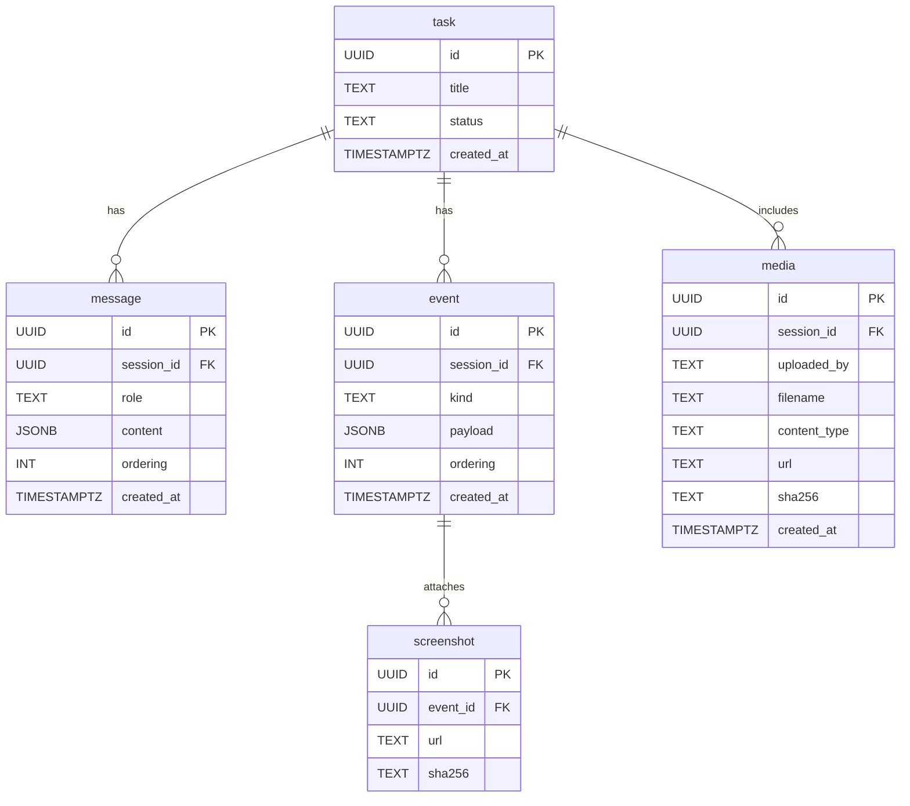

# Computer-Use-Agent

A full-stack, AI-powered computer-automation system that allows agents to control a desktop environment using natural language. This project integrates a FastAPI backend, a React-based interface, and extends the capabilities of [Anthropic's Computer Use demo](https://github.com/anthropics/claude-quickstarts/tree/main/computer-use-demo) to deliver a robust, dockerized Operator-style experience.

## 🎥 Showcase Video

**Link:** 


## 🚀 Features

- **AI-Powered Automation**: Uses Anthropic's Claude API for intelligent task execution
- **Desktop Interaction**: Full mouse, keyboard, and screen control capabilities
- **Real-time VNC**: Live desktop viewing and interaction through noVNC
- **Task Management**: Create, manage, and track automation tasks
- **File Management**: Upload, organize, and process files
- **Real-time Communication**: WebSocket-based chat interface
- **Screenshot Capture**: Automatic screenshot capture for task documentation
- **Multi-modal Support**: Handle text, images, and file inputs

## 🏗️ Architecture

The Computer-Use-Agent follows a microservices architecture with three main components:

<?xml version="1.0" encoding="UTF-8"?>

### Frontend (React + TypeScript)
The user interface is built with React and TypeScript, featuring a VNC viewer for desktop interaction, a chat interface for communicating with the AI agent, file management capabilities, and task management tools.

### Backend (FastAPI + Python)
The backend provides a RESTful API built with FastAPI, handling tasks, messages, events, media uploads, streaming responses, agent control, and real-time WebSocket communication.

### Agent System
Powered by Anthropic's Claude API, the agent system includes computer interaction tools for mouse control, keyboard input, screenshot capture, bash command execution, and file editing operations.

### Infrastructure
The system runs on PostgreSQL for data persistence, with noVNC and X11VNC for remote desktop access, and Xvfb providing a virtual display server for the agent's desktop environment.

## 🛢️ Database Schema



### Core Entities

- **Task**: Represents an automation task with status tracking
- **Message**: Chat messages between user and agent
- **Event**: System events and actions performed by the agent
- **Screenshot**: Captured screenshots for task documentation
- **Media**: Uploaded files and media assets

## 📋 Prerequisites

- **Python 3.10+**
- **Node.js 18+**
- **Docker & Docker Compose**
- **Anthropic API Key**
- **PostgreSQL** (handled by Docker)

## 🚀 Quick Start

### 1. Clone the Repository

```bash
git clone <repository-url>
cd Computer-Use-Agent
```

### 2. Environment Setup

Create a `.env` file in the root directory:

```env
# Database Configuration
DB_NAME=computer_use_agent
DB_USER=postgres
DB_PASS=your_password
DB_PORT=5432

# API Configuration
ANTHROPIC_API_KEY=your_anthropic_api_key
PRODUCTION=false

# Display Configuration
WIDTH=1024
HEIGHT=768
DISPLAY_NUM=1
```

### 3. Start with Docker Compose

```bash
# Build and start all services
docker-compose up --build
```

### 4. Access the Application

- **Frontend**: http://localhost:5173
- **Backend API**: http://localhost:8000
- **VNC Viewer**: http://localhost:6080

### Environment Variables

| Variable | Description | Default |
|----------|-------------|---------|
| `DB_NAME` | Database name | `computer_use_agent` |
| `DB_USER` | Database user | `postgres` |
| `DB_PASS` | Database password | Required |
| `DB_PORT` | Database port | `5432` |
| `ANTHROPIC_API_KEY` | Anthropic API key | Required |
| `PRODUCTION` | Production mode | `false` |
| `WIDTH` | Display width | `1024` |
| `HEIGHT` | Display height | `768` |

## 🔗 Resources

- [Anthropic Claude API](https://docs.anthropic.com/)
- [Anthropic Computer Use Demo](https://github.com/anthropics/claude-quickstarts/tree/main/computer-use-demo)
- [FastAPI](https://fastapi.tiangolo.com/)
- [noVNC](https://novnc.com/)
- [SQLModel](https://sqlmodel.tiangolo.com/)
